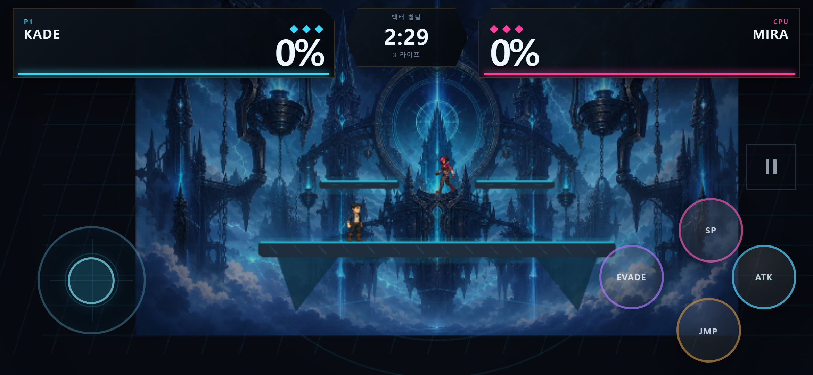

# Rift Forge

Rift Forge는 브라우저에서 바로 플레이하는 오리지널 1 대 1 플랫폼 파이터입니다. 모바일 가로 화면을 우선으로 설계했으며, 키보드·터치·게임패드 입력을 하나의 전투 명령으로 합쳐 동일한 60 Hz 전투 코어에 전달합니다. 전투 화면은 Phaser로 렌더링하지만 판정과 AI는 DOM이나 렌더러 없이도 실행할 수 있습니다.

**모바일/웹 플레이:** <https://flylucky25101.github.io/SUS/>



## 주요 기능

- 3 스톡, 150초 제한의 플레이어 대 CPU 빠른 대전
- 역할과 체급이 다른 캐릭터 4명, 대칭형·이동 발판형 스테이지 2종
- CPU 정지·이동·공격, 충격도·위치 초기화, 히트박스·프레임·입력 표시를 갖춘 훈련 모드
- 고정 시드 AI, 1×/2×/4×/8× 시뮬레이션과 전투 지표를 제공하는 분석용 AI Lab
- 방향 일반/특수 공격, 차지, 공중 공격, 2단 점프, 회피, 발판 통과, 복귀기, 투사체와 반사
- 한국어·영어 UI, 설정 영속화, 왼손 배치, 가상 스틱·버튼 크기/투명도 조절
- 진동·화면 흔들림·모션 감소·음량 설정, 세이프 에어리어와 가로 회전 안내
- 정적 호스팅 가능한 Vite 빌드와 서비스 워커 기반 오프라인 재실행
- Vitest 전투/시나리오 테스트, Playwright 모바일 흐름·레이아웃·PWA 테스트, 결정론적 밸런스 시뮬레이션

## 시작하기

Node.js와 npm이 필요합니다. 잠금 파일과 동일한 의존성을 설치한 뒤 개발 서버를 실행합니다.

Windows에서는 프로젝트 폴더의 [`PLAY_RIFT_FORGE.cmd`](./PLAY_RIFT_FORGE.cmd)를 더블클릭하면 됩니다. PowerShell 실행 정책을 바꾸지 않고 필요한 패키지를 확인한 뒤 서버와 기본 브라우저를 자동으로 엽니다. 플레이하는 동안 열린 터미널 창을 유지하고, 종료할 때 창을 닫으세요.

```bash
npm ci
npm run dev
```

PowerShell에서 `npm.ps1` 실행 정책 오류가 날 때는 `npm` 대신 Windows 실행 파일을 직접 지정할 수도 있습니다.

```powershell
npm.cmd run dev
```

기본 주소는 `http://127.0.0.1:4173`입니다. 첫 실행에서는 짧은 조작 안내가 나타나며, 이후에는 같은 브라우저의 `localStorage` 설정을 사용합니다.

프로덕션 빌드와 로컬 미리보기는 다음과 같습니다.

```bash
npm run build
npm run preview
```

빌드 결과는 `dist/`에 생성됩니다. `base: './'`을 사용하므로 `dist/` 전체를 같은 경로 구조로 정적 호스팅하면 됩니다.

## 게임 모드

| 모드 | 진입과 용도 |
| --- | --- |
| 빠른 대전 | P1/CPU 캐릭터, 스테이지, CPU 난이도(쉬움·보통·어려움)를 고른 뒤 3 스톡 대전을 진행합니다. |
| 훈련 | 캐릭터와 스테이지를 고릅니다. 스톡과 시간 제한 없이 CPU 행동, 충격도/위치 초기화, 히트박스·프레임 데이터·입력 로그를 조절합니다. |
| AI Lab | 모든 빌드의 메인 메뉴에서 접근할 수 있습니다. Kade 대 Suri, Vector Spire, 시드 `1337`, 어려움 AI를 고정하고 배속과 지표·이벤트 로그를 노출합니다. |

## 캐릭터

| 캐릭터 | 역할 | 플레이 성격 |
| --- | --- | --- |
| Kade — 플럭스 수호자 | Vanguard / 균형 | 안정적인 사거리, 방어적 반사기와 고른 복귀력을 갖춘 기준형 전사 |
| Mira — 펄스 러너 | Rush / 속공 | 가벼운 체급, 빠른 발동과 접근, 연속 압박에 강한 근접 전사 |
| Bram — 주조 요새 | Tank / 중량 | 느리지만 갑주와 큰 단발 피해·넉백을 활용하는 중량 전사 |
| Suri — 궤도 직조자 | Control / 제어 | 투사체와 위성 기술로 중장거리 공간을 설계하는 전술가 |

모든 캐릭터는 중립·옆·위·아래 일반기와 특수기, 공중 일반기를 데이터로 정의합니다. 수치와 기술 프레임은 [`src/data/fighters.ts`](./src/data/fighters.ts)에 모여 있습니다.

## 스테이지

| 스테이지 | 성격 |
| --- | --- |
| Vector Spire / 벡터 첨탑 | 좌우가 대칭인 경쟁형 스테이지. 고정 메인 발판과 2개의 단방향 보조 발판을 사용합니다. |
| Drift Garden / 부유 정원 | 세 보조 발판이 예고된 주기로 수평·수직 이동하는 캐주얼 스테이지입니다. 설정에서 스테이지 기믹을 끄면 이동이 정지합니다. |

## 조작법

### 키보드

| 동작 | 키 |
| --- | --- |
| 이동·공격 방향·빠른 낙하 | `WASD` 또는 방향키 |
| 일반 공격 / 차지 | `J` 또는 `Z` — 지상에서 누르고 있다 놓으면 차지 |
| 특수 공격 | `K` 또는 `X` |
| 점프 / 공중 추가 점프 | `L`, `C` 또는 `Space` |
| 회피 | `I` 또는 왼쪽/오른쪽 `Shift` |
| 일시정지 | `Escape` 또는 `P` |

스틱 또는 방향키를 공격과 함께 입력하면 위·아래·옆 기술이 선택됩니다. 방향 없이 지상 일반 공격을 쓰면 잽, 공중 일반 공격은 공중 전용 기술이 나갑니다. `위 + 특수 공격`은 장외에서 돌아올 때 사용하는 복귀기이며, 착지하기 전에는 한 번만 쓸 수 있습니다.

### 터치

- 왼쪽 가상 스틱: 이동, 공격 방향, 아래 입력 빠른 낙하
- `ATK`: 일반 공격과 차지
- `SP`: 특수 공격
- `JMP`: 점프와 공중 추가 점프
- `EVADE`: 회피
- 우측 상단 일시정지 아이콘: 일시정지 메뉴

가상 스틱과 버튼은 서로 다른 포인터를 추적하므로 이동하면서 공격·점프할 수 있습니다. 설정에서 플로팅 스틱, 왼손 배치, 스틱 크기, 버튼 크기와 투명도를 바꿀 수 있습니다.

### 게임패드

첫 번째 게임패드의 왼쪽 스틱, 0번 일반 공격, 2번 특수 공격, 1번 점프, 4번 회피, 9번 일시정지 버튼을 읽습니다. 브라우저와 패드별 실제 표기는 달라질 수 있으므로 릴리스 전에 실기 매핑 확인을 권장합니다.

## PWA와 오프라인 실행

서비스 워커는 프로덕션 빌드에서만 등록됩니다. 개발 서버가 아닌 미리보기 또는 HTTPS 정적 호스트에서 확인하세요.

```bash
npm run build
npm run preview
```

1. 미리보기 주소를 온라인 상태에서 한 번 엽니다.
2. 지원 브라우저의 주소창 또는 메뉴에서 앱 설치를 선택합니다.
3. 서비스 워커가 페이지를 제어한 뒤에는 캐시된 HTML, JavaScript, CSS, 매니페스트와 아이콘으로 오프라인 재실행할 수 있습니다.

서비스 워커는 보안 컨텍스트가 필요합니다. `localhost`/`127.0.0.1` 밖에 배포할 때는 HTTPS를 사용해야 합니다. 새 설치의 최초 방문과 아직 캐시되지 않은 파일에는 네트워크가 필요합니다.

프로덕션 캐시와 오프라인 재로딩은 다음 명령으로 별도 검증할 수 있습니다.

```bash
npm run test:pwa
```

## 품질 검사

| 명령 | 범위 |
| --- | --- |
| `npm run lint` | ESLint 정적 검사 |
| `npm run typecheck` | 앱과 Node 설정의 strict TypeScript 검사 |
| `npm test` | 전투 수학·입력·설정·데이터·AI·전투 상태와 시나리오 테스트 |
| `npm run test:unit` | `npm test`와 같은 단위·시나리오 스위트의 명시적 별칭 |
| `npm run test:e2e` | Chromium 기반 모바일/데스크톱 흐름과 레이아웃 검사 |
| `npm run test:pwa` | 프로덕션 빌드, 매니페스트·서비스 워커·오프라인 재로딩 검사 |
| `npm run test:balance` | 1,600회 빠른 결정론적 AI 대전 이상치 게이트 |
| `npm run test:balance:full` | 2,400회 전체 시뮬레이션과 `BALANCE_REPORT.md` 재생성 |
| `npm run screenshots` | 핵심 가로/세로/협폭/데스크톱 QA 이미지 갱신 |
| `npm run verify` | lint → typecheck → 단위/시나리오 → 2,400경기 전체 밸런스/보고서 갱신 → build → E2E → 프로덕션 PWA 순서의 통합 게이트 |

2026-07-20 최종 자동 검증에서 `npm run verify`가 종료 코드 0으로 완주했습니다. 8개 파일의 56개 단위·시나리오 테스트, 2,400경기 밸런스 게이트, 9개 뷰포트에서 실제 실행된 24개 Playwright 검사, 프로덕션 PWA 오프라인 재로딩 검사가 통과했습니다. 프로젝트별로 적용되지 않는 흐름 30개는 설정대로 스킵됐습니다. 실제 Android/iOS의 디지타이저·진동·설치 UX는 아래 배포 체크리스트의 수동 항목입니다.

전체 밸런스 결과는 [`BALANCE_REPORT.md`](./BALANCE_REPORT.md), 설계 의도는 [`DESIGN.md`](./DESIGN.md), 자동·수동 QA 범위는 [`QA_REPORT.md`](./QA_REPORT.md)를 참고하세요. `npm run verify`가 전체 밸런스 게이트와 보고서 재생성까지 포함하며, `npm run test:balance:full`은 밸런스만 독립적으로 다시 볼 때 사용합니다.

## 프로젝트 구조

```text
src/
  core/       60 Hz 전투 상태, 판정, 물리, 입력 버퍼와 수학
  data/       캐릭터 기술·스탯과 스테이지 정의
  ai/         난이도·역할 기반 결정론적 CPU 입력 정책
  input/      키보드·터치·게임패드 입력 통합
  render/     Phaser 장면, 절차적 그래픽, 카메라와 효과
  ui/         화면 흐름, HUD, 설정, 한국어·영어 문자열
  audio/      Web Audio 효과음·음악과 진동
scripts/      헤드리스 밸런스 시뮬레이션과 집계
tests/        unit, scenarios, e2e, pwa 테스트
public/       매니페스트, 서비스 워커, SVG 앱 아이콘
artifacts/    QA 스크린샷과 생성된 밸런스 JSON
```

## 정적 배포 체크리스트

1. `npm ci`
2. `npm run verify`
3. `dist/` 전체를 HTTPS 정적 호스트에 업로드
4. 실제 모바일에서 가로 전환, 멀티터치, 음향/진동, 설치와 오프라인 재실행 확인
